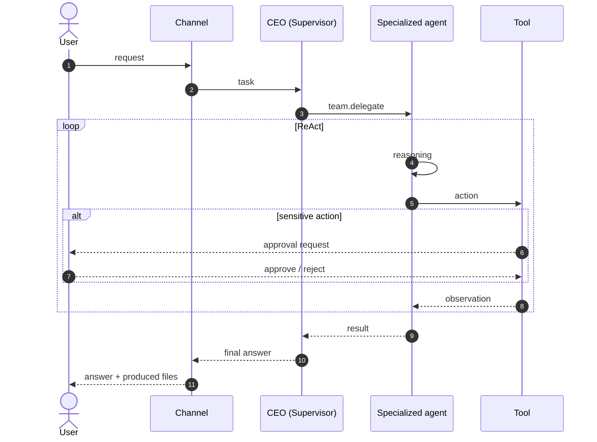

# OpenClaw Agent Team

A Python-based multi-agent platform inspired by OpenClaw and Hermes, built around explicit ReAct agents, Markdown-based memory, reusable Agent Skills and specialized agent teams.

---

## Overview

OpenClaw Agent Team lets a user work with a team of specialized AI agents through a unified interface.

| Agent | Role |
|---|---|
| CEO | Supervisor: understands the request, delegates to the members, assembles the final result |
| GitHub | Repository, code, issue and pull request work |
| LinkedIn | Profile and prospect research, content creation |
| Google Email | Search, reading, summarization, triage and drafting of e-mails |
| Google Research | Web research and source evaluation |
| Code Executor | Safe execution of code, data analysis, testing |
| Writer | Technical documents and reports in Markdown, LaTeX and PDF |

The system can support further business agents (Marketing, Sales, Finance, Operations, HR, Legal, DevOps, ...).

---

## Architecture

```text
                                         USER
                                           │
                                           ▼
┌─────────────────────────────────────────────────────────────────────────────────────┐
│                                   C H A N N E L S                                   │
│                                                                                     │
│      ┌────────────────┐       ┌──────────────────┐       ┌──────────────────┐       │
│      │      CLI       │       │     WebChat      │       │     Telegram     │       │
│      │                │       │    HTTP + SSE    │       │   long polling   │       │
│      └────────────────┘       └──────────────────┘       └──────────────────┘       │
│                                                                                     │
└──────────────────────────────────────────┬──────────────────────────────────────────┘
                                           │
                                           ▼
┌─────────────────────────────────────────────────────────────────────────────────────┐
│                                A P P L I C A T I O N                                │
│                                                                                     │
│       ┌──────────────┐       ┌──────────────────┐       ┌───────────────────┐       │
│       │   RunTask    │       │  ReAct Runtime   │       │      Approval     │       │
│       │              │       │ context · tools  │       │ human in the loop │       │
│       └──────────────┘       └──────────────────┘       └───────────────────┘       │
│                                                                                     │
└──────────────────────────────────────────┬──────────────────────────────────────────┘
                                           │
                                           ▼
┌─────────────────────────────────────────────────────────────────────────────────────┐
│                  T E A M   ·   S U P E R V I S O R   P A T T E R N                  │
│                                                                                     │
│                               ┌─────────────────────┐                               │
│                               │         CEO         │                               │
│                               │      Supervisor     │                               │
│                               │    team.delegate    │                               │
│                               └─────────────────────┘                               │
│                                          │                                          │
│       ┌─────────────┬─────────────┬──────┴──────┬─────────────┬─────────────┐       │
│ ┌───────────┐ ┌───────────┐ ┌───────────┐ ┌───────────┐ ┌───────────┐ ┌───────────┐ │
│ │   GitHub  │ │  LinkedIn │ │   E-mail  │ │  Research │ │  Executor │ │   Writer  │ │
│ │   repos   │ │  profiles │ │   Google  │ │    web    │ │  sandbox  │ │    docs   │ │
│ └───────────┘ └───────────┘ └───────────┘ └───────────┘ └───────────┘ └───────────┘ │
│                                                                                     │
└──────────────────────────────────────────┬──────────────────────────────────────────┘
                                           │
                                           ▼
┌─────────────────────────────────────────────────────────────────────────────────────┐
│                             I N F R A S T R U C T U R E                             │
│                                                                                     │
│    ┌──────────────────┐       ┌──────────────┐       ┌────────────────────────┐     │
│    │     Markdown     │       │     LLM      │       │      Integrations      │     │
│    │ memory · skills  │       │   DeepSeek   │       │ GitHub · Google · Web  │     │
│    └──────────────────┘       └──────────────┘       └────────────────────────┘     │
│                  ┌──────────────────┐       ┌────────────────────┐                  │
│                  │     Sandbox      │       │     Documents      │                  │
│                  │   code · LaTeX   │       │  MD · LaTeX · PDF  │                  │
│                  └──────────────────┘       └────────────────────┘                  │
│                                                                                     │
└─────────────────────────────────────────────────────────────────────────────────────┘
```

### Agents, tools and approvals

| Agent | Allowed tools | Approval required |
|---|---|---|
| **CEO** | `team.members`, `team.delegate`, `memory.update` | none |
| **GitHub** | `github.search_repository`, `search_code`, `get_issue`, `get_pull_request`, `get_authenticated_user` | `create_issue`, `comment_issue`, `create_branch`, `create_pull_request` |
| **LinkedIn** | `linkedin.search_profile`, `get_profile` | `publish_post`, `send_message` |
| **Google Email** | `google.email_search`, `email_read`, `email_draft` | `email_send` |
| **Google Research** | `web.search`, `web.open`, `web.extract` | none |
| **Code Executor** | `code.execute`, `code.terminal`, `code.read_file`, `write_file`, `patch_file`, `web.search`, `web.extract` | none |
| **Writer** | `docs.read`, `docs.write`, `docs.patch`, `web.*` | `docs.compile_pdf` |

### Life of a task



---

## Core Concepts

### Agents

An agent is defined by:

```text
Profile
Skills
Tools
Memory
```

Agent identity is primarily Markdown-based:

```text
agents/github/
├── agent.yaml
├── SOUL.md
├── USER.md
├── MEMORY.md
├── AGENTS.md
└── HEARTBEAT.md
```

`agent.yaml` declares the agent's skills, its allowed tools, the tools that need approval, its LLM, and an optional `role` (the label shown in the WebChat, 40 characters max).

### Skills

Skills are reusable capabilities. A skill can be used by several agents.

```text
skills/
└── github/
    └── repository-analysis/
        ├── SKILL.md
        ├── scripts/
        ├── references/
        └── assets/
```

### Tools

Tools provide access to external systems.

```text
GitHub
Google
LinkedIn
Web (search, open, extract)
Filesystem
Code execution (sandboxed)
Documents (Markdown, LaTeX and PDF)
```

Agents receive only the tools they are authorized to use.

### Code Executor Agent

The Code Executor Agent runs code safely. It writes short Python scripts that orchestrate its tools (Programmatic Tool Calling).

```text
Code Executor Agent
├── code.execute       (Programmatic Tool Calling)
├── code.terminal      (sandboxed)
├── code.read_file / code.write_file / code.patch_file
└── web.search / web.extract   (when needed)
```

Skills: Code Execution, Data Analysis, Testing.

A script cannot widen the agent's permissions: every tool it calls goes through the same permission and approval rules as a direct call.

`code.execute` and `code.terminal` run without approval. The code tools are only offered when `OPENCLAW_CODE_SANDBOX=subprocess`. On Windows the sandbox is refused unless `OPENCLAW_CODE_ALLOW_UNISOLATED=true` is set (no network isolation). Limits (timeout, CPU seconds, memory, output size) are set with the `OPENCLAW_CODE_*` variables of `.env.example`.

The agent belongs to the `default` team and can be addressed directly or through the supervisor.

### Writer / Documentation Agent

The Writer prepares documents: technical documentation (README, ADR, specifications, changelogs, tutorials), reports, and edits or summaries of existing text. It produces Markdown, LaTeX and PDF: the agent writes the LaTeX source and a tool compiles it to PDF.

```text
Writer / Documentation Agent
├── docs.read
├── docs.write / docs.patch     (Markdown, LaTeX)
├── docs.compile_pdf            (requires approval)
└── web.search / web.open / web.extract   (when needed)
```

Skills: Technical Documentation, Report Writing, Editing and Proofreading, LaTeX Document Production.

The writer only prepares documents: it has no tool that publishes, sends or contacts anyone. Publishing and sending stay with the channel agents (LinkedIn, Google Email) and their approvals.

LaTeX compilation is treated as running untrusted code: shell escape disabled, files limited to the document's directory, no network, time limit. It needs a LaTeX engine installed on the machine (XeLaTeX by default, `OPENCLAW_DOCS_LATEX_ENGINE`). Without an engine, or where network isolation is not available (Windows: `OPENCLAW_DOCS_ALLOW_UNISOLATED=true` compiles anyway, without network isolation), `docs.compile_pdf` is not offered: the agent still runs, delivers the `.tex` source and says that no PDF could be produced.

Documents live in `workspace/shared/reports/` (`OPENCLAW_DOCS_DIR`). The files a task produced are offered for download under the answer in the WebChat, and the Documents page lists every document, newest first. They are served by `GET /api/documents/<path>` and listed by `GET /api/documents` (authenticated, limited to the documents directory).

### Memory

Memory uses Markdown as the canonical representation.

```text
MEMORY.md
USER.md
```

This makes agent memory transparent, editable, versionable and inspectable.

---

## ReAct Runtime

The execution loop is intentionally explicit:

```text
Observation → Reasoning → Action → Observation → ... → Final Answer
```

The runtime controls context, memory, skills, tools, permissions, approvals, execution and errors.

---

## LLM

Default provider: **DeepSeek**.

The provider is abstracted behind an application port, so other models can be supported without modifying the domain.

---

## Multi-Agent Teams

Teams are declared in `teams/<id>/team.yaml`. Each one uses a Supervisor architecture.

| Team | Supervisor | Members |
|---|---|---|
| `default` | ceo | github, linkedin, google-email, google-research, code-executor, writer |
| `research` | ceo | google-research, github |
| `growth` | ceo | linkedin, google-research |
| `executive` | ceo | none |

The active team is selected with `OPENCLAW_TEAM`.

Other patterns are supported conceptually:

**Peer-to-peer**

```text
Marketing ↔ Finance
     ↕          ↕
   Sales ↔ Operations
```

**Shared vault**

```text
Agent A ──┐
Agent B ──┼── Shared Memory
Agent C ──┘
```

---

## Channels

### CLI

```bash
uv run openclaw
```

### WebChat

```bash
uv run openclaw web
```

HTTP/SSE channel with authentication, task lifecycle, approvals and live event streaming. Host and port come from `OPENCLAW_WEB_HOST` and `OPENCLAW_WEB_PORT`. Each agent appears with its `role` label, and the tool listing shows each tool's real risk level and approval requirement.

### Telegram

```bash
uv run openclaw telegram
```

The bot uses long polling (no public address needed).

* Free text goes to the supervisor of the team (`TELEGRAM_TEAM`, default `OPENCLAW_TEAM`)
* `/run <agent> <task>` gives a task to one agent
* `/agents` lists the agents
* Only the users listed in `TELEGRAM_ALLOWED_USER_IDS` (numeric Telegram ids, mandatory), in private chats, are served
* An action that needs approval arrives as a message with Approve / Reject buttons; no answer within `TELEGRAM_APPROVAL_TIMEOUT` seconds counts as a rejection
* One task runs at a time per chat
* Answers are sent as Telegram HTML: the Markdown of the agents (headings, bold, italic, strike-through, code, code blocks, links, lists, block quotes, tables) is converted and the rest is escaped; a message Telegram refuses is sent again as plain text
* The files the writer produced during the task (Markdown, LaTeX, PDF) are sent to the chat as documents after the answer

Group chats, images and voice messages are not supported.

---

## Project Structure

```text
openclaw-agent-team/
├── src/
├── agents/
├── skills/
├── teams/
├── workspace/
├── tests/
├── scripts/
└── pyproject.toml
```

---

## Technology

```text
Python · DeepSeek · Markdown
DDD · Hexagonal Architecture · ReAct · Agent Skills
Integrations: GitHub, Google, LinkedIn, Web (Tavily, Brave)
Channels: CLI, WebChat, Telegram
Optional infrastructure: LangChain, LangGraph
```

---

## Design Philosophy

> Agents should be composed from text, skills and capabilities rather than hard-coded classes.

* A new agent is a folder with `agent.yaml`, `SOUL.md`, `USER.md`, `MEMORY.md`, `AGENTS.md` and `HEARTBEAT.md`
* A new capability is a `SKILL.md`
* A new external integration is a tool adapter

---

## Security

The system follows least privilege.

* Agents do not automatically receive access to all tools
* Sensitive actions require human approval: sending e-mail, publishing LinkedIn content, sending messages, creating issues, branches and pull requests, compiling documents
* Code and LaTeX run in a restricted sandbox
* Secrets are never stored in Markdown memory

---

## Getting Started

Install dependencies:

```bash
uv sync
```

Create `.env` from `.env.example`, then start a channel:

```bash
uv run openclaw            # CLI
uv run openclaw web        # WebChat
uv run openclaw telegram   # Telegram
```

Run tests and linting:

```bash
uv run pytest
uv run ruff check .
```

---

## Configuration

The CLI loads the project `.env` through `python-dotenv` without overriding variables already set by the shell.

| Variable | Purpose |
|---|---|
| `LLM_PROVIDER`, `DEEPSEEK_API_KEY`, `DEEPSEEK_MODEL` | LLM provider |
| `GITHUB_TOKEN` | GitHub access |
| `GOOGLE_CREDENTIALS_FILE`, `GOOGLE_TOKEN_FILE` | Google access |
| `LINKEDIN_ACCESS_TOKEN` | LinkedIn access |
| `WEB_SEARCH_PROVIDERS`, `TAVILY_API_KEY`, `BRAVE_SEARCH_API_KEY` | Web search providers, in fallback order (default `tavily,brave`) |
| `OPENCLAW_TEAM` | Active team |
| `OPENCLAW_WORKSPACE`, `OPENCLAW_LOG_LEVEL` | Workspace directory, logging |
| `OPENCLAW_WEB_HOST`, `OPENCLAW_WEB_PORT` | WebChat server |
| `TELEGRAM_BOT_TOKEN`, `TELEGRAM_ALLOWED_USER_IDS` | Telegram bot (both mandatory) |
| `TELEGRAM_TEAM`, `TELEGRAM_APPROVAL_TIMEOUT`, `TELEGRAM_API_URL` | Telegram options |
| `OPENCLAW_CODE_SANDBOX`, `OPENCLAW_CODE_*` | Code sandbox mode and limits |
| `OPENCLAW_DOCS_DIR`, `OPENCLAW_DOCS_LATEX_ENGINE`, `OPENCLAW_DOCS_*` | Documents directory and LaTeX compilation |

---

## Author

Developed by **Adama Coulibaly**  
AI Engineer | Finance Enthusiast

---

## License

License to be defined.